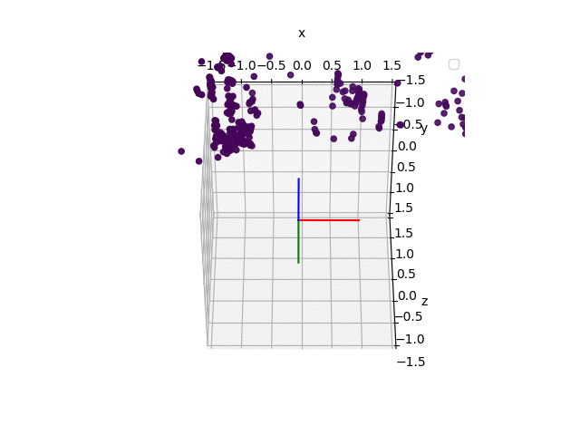

# Brief: 
This was the capstone project for my course
_[CS231A](http://web.stanford.edu/class/cs231a/): Computer Vision, From 3D Reconstruction to Recognition_. 

* [Presentation slides here](https://docs.google.com/presentation/d/1grKiimDXM6Rfszo6z3Zg5X653VU50nB1VyK5uZEYOJY/edit?usp=sharing)

* A successfully initialized Monocular Visual Odometry demo'ed below
 

------------------------------
(It was branched from EuRoC dataset_tools git repo. Keep those info. below)
# dataset_tools
Loader for the generic ASL dataset format. The corresponding datasets can be foung here: http://projects.asl.ethz.ch/datasets/doku.php?id=kmavvisualinertialdatasets .

Forked from original repo.
1. Modified certain files to allow Octave to run dataset_plot.m.
2. Add dependency on libyaml python library from https://github.com/yaml/libyaml
