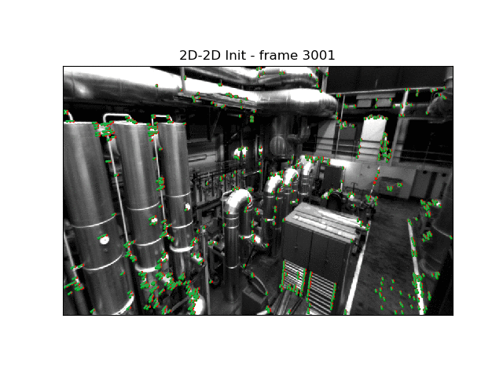
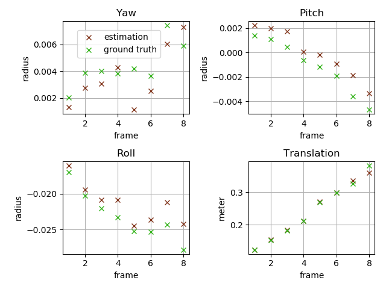
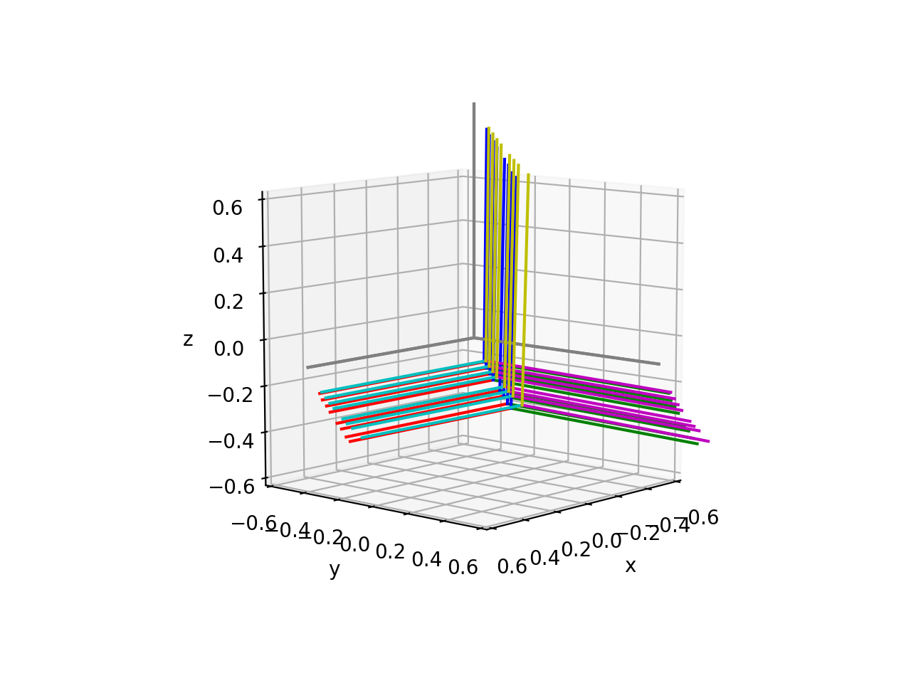
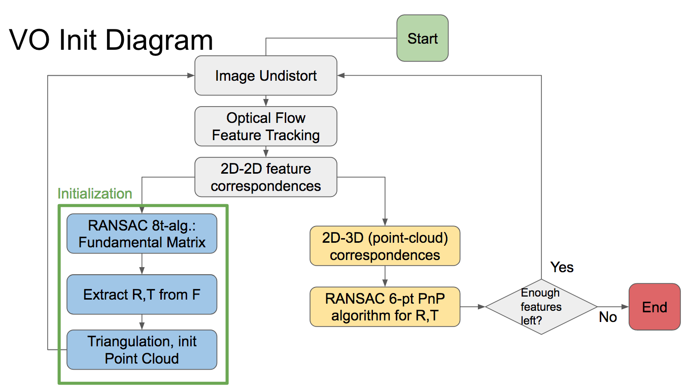

## Brief: 
This was the capstone project for my course
_[CS231A](http://web.stanford.edu/class/cs231a/): Computer Vision, From 3D Reconstruction to Recognition_. 

* [Presentation slides here](https://docs.google.com/presentation/d/1grKiimDXM6Rfszo6z3Zg5X653VU50nB1VyK5uZEYOJY/edit?usp=sharing)
* [Project report paper here](./cs231a_project_report_MonoVOInit.pdf)

## Project summary

 (The project assumes EuRoC data set is available/downloaded previously. The path to the EuRoC dataset is set in main.py. For example, basedir = '~/study/asl_dataset/ijrr_euroc_mav_dataset/machine_hall/MH_01_easy/')

* A successfully initialized Monocular Visual Odometry demo'ed below. A log of one such run can be found at [./paper_related/sample_main.log](./paper_related/sample_main.log). 

 
 

* Estimation vs. Ground Truth 
	* Comparison of a successful initialized VO. 

(Below: RGB - XYZ axis of estimation, CMY - XYZ axis of GT)

* HOWTO
	* Program flow chart

	* Extract coordinate system etc. info. from dataset. Two files will be generated for main.py to use:
		* T_WC.npy # Groud-truth world coordinates to camera world origin (1st frame in VO).
		* TS.npy # Timestamp array of ground truth
		
	`$ python trajectory.py
	`

	* Run main program. The process will generate all figures for visualization, as well as the final comparison between estimation values and ground truth. 

	`$ python main.py
	`

## TODO
* Flow-based code -> OOP: Code is pretty messy due to tight schedule of the class. Need to move to OOP style, currently it is a mess of flow-based operations. 
* VO Initialization -> Complete VO: 
	* Add new feature search in Optical-Flow when number of tracked features goes below threshold or accumulated error goes beyond certain threshold. 
	* Maintain local feature map and add Bundle-Adjustment to optimize local map. Current BA is only used to sanity check structure-only non-linear optimized initial point cloud quality. It is not stitched into pipeline. 
* Python -> C++, real-time app like SVO. 

